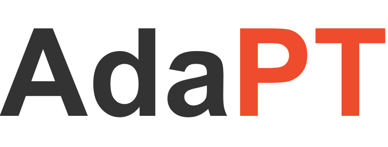

<div align="center">
  
</div>

<h1 align="center"> </a></h1>
<h3 align="center"> Fast Emulation of Approximate DNN Accelerators in PyTorch  </a></h3>

<p align="center">
  <a href="#Overview">Overview</a> •
  <a href="#Dependencies">Dependencies</a> •
  <a href="#Quick-start"> Quick start </a> •
  <a href="#References">References</a> •
  <a href="#Contact">Contact</a>
</p>


## Overview

Current state-of-the-art employs approximate multipliers to address the highly increased power demands of DNN accelerators. However, evaluating the accuracy of approximate DNNs is cumbersome due to the lack of adequate support for approximate arithmetic in DNN frameworks. 

**AdaPT** is a fast emulation framework that extends PyTorch to support approximate inference as well as approximation-aware retraining. AdaPT can be seamlessly deployed and is compatible with the most DNNs. You can evaluate the framework on several DNN models and application fields including CNNs, LSTMs, and GANs for a number of approximate multipliers. 


## Dependencies 

* A linux system with docker installed
      
## Quick start 

The project has everything installed inside the provided docker image and the python path is set to the adapt folder to load the modules. 

Run the following commands to get started:

* Run docker container
```bash
./docker/run_docker.sh
``` 

* Run jupyter on port 8888
```bash
./examples/run_jupyter.sh
``` 
Then copy the jupyter link into a browser and head over the examples folder to run the notebooks

Optional:
* You can use the provided tool ```LUT_convert.ipynb``` to create the C header file for your custom approximate multiplier  <br />
 **important**: only 8-bit signed multipliers are supported at the moment. So the C header files must include a 256x256 array.
* We provide a link with several model weights to test them in the example notebooks. <br />
 You must save them inside ```examples/models/state_dicts/``` folder. [[link]](https://drive.google.com/drive/folders/1HtxlPWGXG6svdHAs197uIirt0yHLo_tC?usp=sharing)

## References

The repo is a re-implementation of AdaPT framework and new features will be added shortly.

#### Publication

If you use any part of this work, we would love to hear about it and would very much appreciate a citation [[arxiv link]](https://arxiv.org/abs/2203.04071):

```
@article{dimdano2022adapt,
  author =       "Dimitrios, Danopoulos and Georgios, Zervakis and Kostas, Siozios and Dimitrios, Soudris and Jörg, Henkel",
  title =        "AdaPT: Fast Emulation of Approximate DNN Accelerators in PyTorch",
  journal =      "arXiv preprint: 2203.04071",
  year =         "2022",
}
```
#### Acknowledgements
This work has been supported by the E.C. funded program SERRANO under H2020 Grant Agreement No: 101017168 and in parts by the German Research Foundation (DFG) project ``ACCROSS''  HE 2343/16-1.

#### Contact 

* Contributor <br/>
`Dimitrios Danopoulos`: dimdano@microlab.ntua.gr


